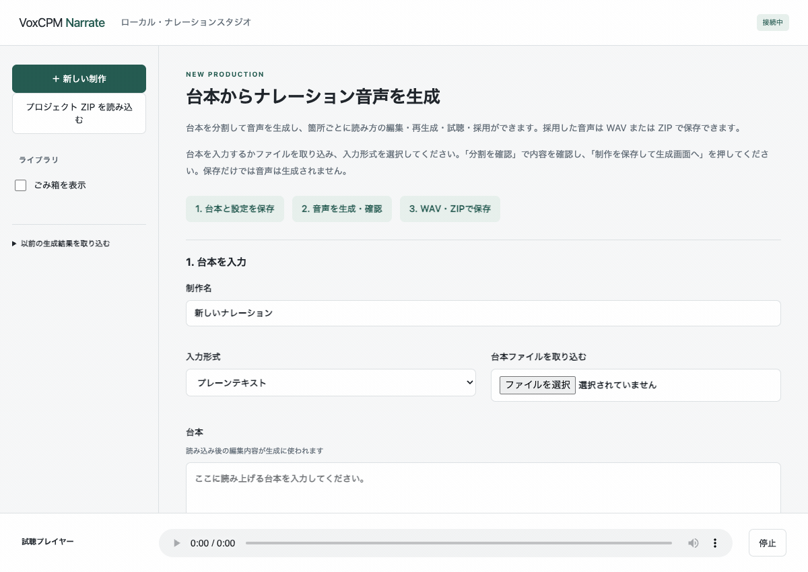

# VoxCPM-Narrate

[VoxCPM2](https://github.com/OpenBMB/VoxCPM) を使い、日本語の台本からナレーションを制作するローカル TTS ツールです。ブラウザーで編集・録音・候補比較・書き出しを行う Web UI と、台本をまとめて生成・改善する CLI を提供します。

- Markdown、プレーンテキスト、行単位テキスト、SSML サブセットを分割して生成
- 参照音声による声質の再現、確認済み文字起こしを使った話し方の再現、参照なしの Voice Design
- 読み辞書、数字・日付の日本語読み、任意の平均話速補正
- Web の採用・完成音声書き出し前に、ローカル ASR で原稿との大きな不一致を検査
- 候補と採用履歴の保存、中断後の再開、制作途中のプロジェクト ZIP の保存・復元
- 原音と別に文間・音量を整えた WAV を作成。任意で OpenRouter / Azure OpenAI による評価も利用可能

音声合成と ASR はローカルで動作します。初回のモデル取得にはネットワーク接続が必要です。外部 LLM 評価を有効にすると、評価用の文章や音声を選択したサービスへ送信します。Web UI は認証のない単一ユーザー向けアプリです。

## 操作イメージ



架空の台本による操作例です。入力 → 分割確認 → 制作保存 → 読み方の編集 → 外部AIの接続先選択を紹介しています。音声合成・外部APIへの送信は含みません。

## 目次

- [セットアップ](#セットアップ)
- [クイックスタート](#クイックスタート)
- [Web での制作](#web-での制作)
- [日本語の読みと音声検査](#日本語の読みと音声検査)
- [書き出しとバックアップ](#書き出しとバックアップ)
- [入力形式](#入力形式)
- [CLI での生成と改善](#cli-での生成と改善)
- [外部 LLM 評価と環境変数](#外部-llm-評価と環境変数)
- [Docker / クラウドでの起動](#docker--クラウドでの起動)
- [API](#api)
- [構成と開発用コマンド](#構成と開発用コマンド)
- [トラブルシューティング](#トラブルシューティング)
- [ライセンス](#ライセンス)

## セットアップ

リポジトリのルートでコマンドを実行してください。

- Python **3.10 以上、3.13 未満**。`.python-version` と Docker は 3.12 を使用します。
- [uv](https://docs.astral.sh/uv/) を事前にインストールしてください。起動スクリプトは uv を自動インストールしません。
- ffmpeg を PATH に配置してください。参照音声の形式変換、仕上げ、平均話速補正で使用します。
- `.sh` ラッパーには Bash 3.2 以上が必要です（`sh script.sh` ではなく `./script.sh` または `bash script.sh` で実行）。Python CLI はラッパーを介さず実行できます。
- 推論デバイスは `auto` / `cpu` / `mps` / `cuda`。必要なメモリと実行時間はデバイス、モデル、台本長に依存します。まず短い台本で確認してください。
- VoxCPM2 と SenseVoice の初回取得用にネットワーク接続とモデル保存領域を確保してください。

```sh
uv sync --locked
ffmpeg -version
```

Docker を使う場合、ホストの Python・uv・ffmpeg は不要です。[コンテナの起動手順](#docker--クラウドでの起動)を参照してください。

## クイックスタート

### ブラウザーで始める

```sh
./serve_web.sh
```

[http://127.0.0.1:7860](http://127.0.0.1:7860) を開き、台本を入力して分割を確認し、制作を保存します。参照音声は任意です。最初は数文だけ生成して、読みと声を確認してください。

ラッパーは依存関係を同期してからサーバーを起動します。直接起動する場合は次を使います。

```sh
uv run voxcpm-narrate-web
```

ブラウザーを閉じてもサーバーが動いていれば処理は継続します。サーバー再起動後は処理を自動再開せず、中断状態として保存します。ライブラリから制作を開いて再開してください。

### CLI で始める

参照音声を用意しなくても、同梱の架空サンプルで試せます。

```sh
# 分割だけを確認。モデルのロード・音声生成は行いません
uv run voxcpm-narrate synthesize \
  --input examples/script.md --dry-run --output-dir output/preview

# 先頭3セグメントだけ生成
uv run voxcpm-narrate synthesize --input examples/script.md --limit 3

# 全編を生成
uv run voxcpm-narrate synthesize --input examples/script.md
```

独自の台本や録音は `workspace/`、生成物は `output/` に置いてください。これらの作業データは git 管理外です。`examples/` は公開用の汎用サンプル専用です。

```sh
cp examples/script.md workspace/script.md
./generate_speech.sh --no-reference --limit 3

# 参照音声を用意した場合
./generate_speech.sh --input workspace/script.md --reference workspace/source.wav
```

Python CLI は `--reference` を省略すると参照なしで生成します。`generate_speech.sh` は参照音声を自動探索するため、参照なしの場合は `--no-reference` を明示します。

## Web での制作

UI は FastAPI と自前の CSS / JavaScript で構成し、Material Design に着想を得た外観を使用しています。

### 基本の流れ

1. 制作名と台本を入力し、入力形式・話し方・参照音声を設定します。
2. 「分割を確認」で本文、変換後の読み、セグメント前の間を確認します。
3. 制作を保存し、読み辞書や各セグメントの本文・読み・話し方を調整します。
4. 未生成部分または選択箇所を生成します。初回生成は音声検査に合格すると採用されます。
5. 個別の再生成では候補を試聴し、採用する版を選びます。以前の版も履歴から採用できます。
6. 全セグメントを採用したら、全文 WAV や完成音声 ZIP を保存します。

保存済みの本文や読みを編集しても、既存音声は自動では変わりません。編集を保存して再生成し、採用してください。編集の版番号を検証し、古い画面からの上書きを防ぎます。

制作名は保存後も変更できます。「全て再生成」は全セグメントを新しい乱数で生成し、全て合格した時点で一括採用します。失敗・中断時は以前の採用音声と書き出しを保持します。再実行すると先頭からやり直します。

### 参照音声・ブラウザー録音

新規制作で標準、落ち着いたナレーション、明るい案内、プレゼンテーション、やさしい語りかけなどの話し方を選び、必要に応じて指示を編集できます。参照なしの声はセグメント間で揺れる場合があります。

録音は localhost または HTTPS とマイクの許可が必要です。話し方に応じた例文を読み、停止後に試聴します。30秒で自動停止し、録り直しやファイル選択も可能です。保存前にページを閉じると録音は失われます。

- アップロード形式：WAV / OGG / MP3 / FLAC / M4A / WebM / MP4
- 上限：100 MB、変換後の長さは0秒より長く120秒以内
- 録音の目安：5〜30秒。静かな環境で、声が割れない音量で録音してください。
- 音声は制作フォルダーへコピー・変換されるため、元のファイルを移動しても利用できます。

「録音を文字起こしする」でローカル ASR を使うか、実際に話した内容を入力します。録音と照合して修正し、確認にチェックを付けてください。録音と確認済み文字起こしを使う場合は両方をモデルに渡して話し方を再現します。この設定を外すと声質の参照のみになります。録音用の例文は、確認済み文字起こしとして自動使用されません。

同梱の `examples/reference_recording.md` と `examples/reference_recording_alt.md` も録音用に使えます。

### 平均話速の補正

既定は「補正しない」です。「平均話速を揃える」では、確認済みの参照音声、または数値目標を使えます。数値目標の既定は7モーラ/秒、設定範囲は2〜12です。

日本語の読みからモーラ数を推定し、前後の無音と0.25秒以上の文中の間を除いて平均話速を測ります。目標との差が3%以内なら補正を省略し、それ以外は速度倍率0.9〜1.1の範囲で ffmpeg による補正を行います。

補正範囲外、推定読みを含む語、短すぎる音声、ツール失敗などでは原音を使います。話速の差だけで不合格・再生成にはしません。補正前の音声は `.raw.wav` として残し、補正結果を版ごとに記録します。文章内の瞬間的な速度や抑揚を一定にする機能ではありません。

### ライブラリとごみ箱

「削除」は制作をごみ箱へ移動します。通常の一覧・音声取得から外れますが、データは残るためディスク容量は減りません。「ごみ箱を表示」から復元できます。処理中の制作は削除できません。

「ごみ箱を空にする」は確認した制作の台本・参照音声・候補・書き出しを完全削除します。確認後にごみ箱の内容が変わった場合は停止します。削除途中で失敗した制作は復元できませんが、原因を解消して完全削除を再試行できます。共通読み辞書と取り込み元は削除しません。

## 日本語の読みと音声検査

### 読み辞書と数字の変換

Web では制作ごとの読み辞書、セグメントの読み方上書き、共通読み辞書を使えます。共通辞書は新規制作へコピーされ、既存制作へ取り込む場合はその制作の登録を優先します。未知語候補は確認の手助けであり、正しい読みを自動確定する機能ではありません。読みの事前試聴後も、必要な辞書保存を行ってください。

数字の変換は読み方上書き・辞書適用後に行います。日本語の本文は VoxCPM の中国語・英語用正規化器へ渡しません。

- **新規 Web 制作**：数字変換はオン。「漢数字＋助数詞を保持」が既定です。例えば `2030年4月15日` は `二千三十年四月十五日` に変換します。
- **ひらがな方式**：数字をひらがなの読みに展開します。設定のない過去の制作はこの方式を保持します。
- **CLI**：既定の `--normalize` はひらがな方式の数字読み変換です。音量調整ではありません。`--no-normalize` で無効にできます。Web の数字表記選択や共通辞書を CLI が自動で引き継ぐことはありません。

Web の既存制作では、セグメントごとに数字変換と方式を上書きできます。手入力したかなはそのまま使われます。特殊な助数詞・型番・固有名詞は読み方上書き、辞書、SSML の `<sub alias>` で指定してください。表記の調整は発音やアクセントの正しさを保証しません。

実際の生成入力、処理バージョン、モデル revision、実行情報は CLI の `segments/*.input.json` または Web の各音声版へ記録します。

未知語候補を CLI で確認する場合：

```sh
uv run python -m voxcpm_narrate.pronunciation workspace/script.md
uv run python -m voxcpm_narrate.pronunciation workspace/script.md \
  --dictionary workspace/dictionary.json
```

辞書ファイルは `{"用語": "読み"}` 形式の JSON です。このコマンドの辞書指定は候補抽出用です。

### Web の採用前検査

Web では SenseVoice を CPU 上で動かし、採用前に原稿との一致を確認します。「自動改善」「ASR」の任意設定とは独立した必須処理で、有料 API は使いません。

- 8秒以下は全文、それより長い候補は全文と約6秒ごとの区間を認識します。2秒未満の末尾区間は前の区間へ結合します。
- 表記とかな読みの両方で照合します。全文の誤り率45%超、区間の最良一致部分との誤り率50%超、冒頭の余計な発話などを不合格にします。
- 無音、不正な音声、全文の認識不能、120秒超の候補も不合格です。
- 外国語タグだけでは不合格にせず、原稿一致を優先します。中程度の差、日付・数値の相違は試聴を促す確認事項になります。

不合格なら最大2回再生成します（初回を含め計3回）。合格できない場合や検査不能時は採用を止めます。以前の採用音声は保持し、不合格候補も理由付きで試聴できます。検査結果は音声ハッシュと検査バージョン付きで保存します。

「音声を再検査」は既存音声を検査し直す操作で、生成は行いません。既存・取り込み音声も採用や完成音声の書き出し時に検査します。個別候補の試聴、読みの事前試聴、制作再開用プロジェクト ZIP は完成音声の採用ゲートとは別です。

ASR には誤検出・見落としがあります。合格後も読み、数値、抑揚を試聴してください。**CLI の通常生成にはこの必須ゲートはありません。** CLI 改善での `--asr` は任意の採点機能です。

## 書き出しとバックアップ

### 完成音声

全セグメントの採用後に書き出します。

- **原音 WAV**：採用音声と指定した間を結合した全文音声。
- **仕上げ WAV**：文間・文ごとの音量・全体のラウドネスを調整した別ファイル。
- **原音・台本・条件 ZIP**：全文、章別、セグメント音声、台本、manifest、制作情報、参照音声（ある場合）。
- **仕上げ音声・測定結果 ZIP**：仕上げ済み全文と章別音声、測定 JSON、原音など。

仕上げは生成音声の FLOAT WAV を保持し、PCM_24 WAV を別に作ります。暫定目標は −16 LUFS / −1 dBTP 以下です。すでに大きい入力には音量を下げない適応目標を使います。無音・極小音量・3秒未満の音声は過剰増幅を避けてエラーにします。これはアプリの試聴用設定で、納品規格への適合保証ではありません。

CLI での測定・仕上げ：

```sh
uv run python -m voxcpm_narrate.audio_quality output/voxcpm2/latest/full.wav

uv run python -m voxcpm_narrate.audio_quality \
  output/voxcpm2/latest/full.wav \
  --manifest output/voxcpm2/latest/manifest.json \
  --segments-dir output/voxcpm2/latest/segments \
  --output output/voxcpm2/latest/finished.wav
```

後者は `finished.wav` と `finished.quality.json` を作成します。

### 制作再開用プロジェクト ZIP

「プロジェクト ZIP を保存」は未生成・制作途中の状態も保存できます。台本、生成設定、制作の辞書、参照音声、全候補、採用履歴、保存済み編集を含みます。処理の完了または中断を待ち、未保存の編集と辞書を保存してから実行してください。

ライブラリの「プロジェクト ZIP を読み込む」で、新しい制作として復元します。既存制作や共通辞書は上書きしません。ZIP と展開後合計はそれぞれ2 GBまでです。API キーとモデル本体は含みません。ローカルモデルを使った制作は取り込み後に既定モデルへ切り替わります。

完成音声用 ZIP はこの復元形式とは異なります。ZIP には台本や参照音声が含まれるので、共有前に中身を確認してください。

CLI の既存 run はライブラリの取り込み機能で Web 制作に変換できます。全ライブラリを保全する場合はサーバーを停止し、`VOXCPM_WEB_OUT` 以下を SQLite と音声ファイルごとバックアップしてください。

## 入力形式

CLI の `--mode auto` は `.ssml` / `.xml` を SSML、`.md` / `.markdown` を Markdown、`.txt` / `.text` を plain として扱います。その他の拡張子は Markdown が既定です。Web では入力形式を選択します。

### Markdown

`### 読み上げ本文` の下にある本文だけを抽出し、直前の `##` 見出しをセクション名にします。他の説明文を読み上げ対象から分けられます。

```markdown
## はじめに

### 読み上げ本文

こんにちは。これから施設の利用方法をご案内します。
```

CLI の `--narration-heading Narration` で抽出対象の見出し名を変更できます。

### プレーンテキスト・行単位

`plain` は本文全体を対象にします。`lines` は空行と `#` で始まる行を除き、各行を段落として扱います。長い行はさらにセグメントへ分割されます。

```sh
uv run voxcpm-narrate synthesize --input workspace/notes.txt --mode plain
uv run voxcpm-narrate synthesize --input workspace/lines.txt --mode lines
```

### SSML サブセット

VoxCPM2 が SSML を直接解釈するのではなく、本ツールがセグメント・間・話し方の指示へ変換します。

- `<speak>`、`<p>`、`<s>`：構造と区切り
- `<break time="400ms"/>`、`strength`：セグメント間の間
- `<prosody>`、`<emphasis>`：話し方のヒント。厳密な音高・速度の再現指定ではありません。
- `<sub alias="エーアイ">AI</sub>`：読みの置き換え

```xml
<speak xml:lang="ja-JP">
  <p>施設のご案内です。<break time="500ms"/>
    <prosody rate="slow">足元にお気をつけください。</prosody>
  </p>
</speak>
```

SSML 全仕様には対応していません。`examples/script.ssml` で対応する記法を確認できます。分割は句読点や空白を優先し、長すぎる部分は文字数で分割します。`--max-chars` は分割本文の上限であり、後から加わる読み変換や制御文を含むモデル入力長の上限ではありません。

## CLI での生成と改善

### 生成オプション

```sh
uv run voxcpm-narrate synthesize --help
uv run voxcpm-narrate improve --help
```

主な生成設定：

- `--input PATH`：台本（必須）。`--mode` の既定は `auto`。
- `--reference PATH`：参照音声。省略すると参照なし。
- `--model-id`：既定 `openbmb/VoxCPM2`。
- `--device`：既定 `auto`。`--optimize` は `torch.compile` を有効化（既定無効）。
- `--max-chars`：既定120。`--section N` は1始まりのセクション選択、`--limit N` は先頭件数。
- `--cfg-value`：既定2.0。`--inference-timesteps`：既定10。`--seed`：既定42。
- `--control`：話し方の指示。`--no-control` はユーザー指定の制御文を外しますが、日本語生成用の内部指示まで全て消す指定ではありません。
- `--no-normalize`：数字の日本語読み変換を無効化。
- `--out-root`：既定 `output/voxcpm2`。`--output-dir` は出力先を直接固定。
- `--dry-run`：分割情報だけ保存。モデルも参照音声の変換も不要。

```sh
uv run voxcpm-narrate synthesize \
  --input examples/script.ssml --max-chars 80 --limit 3 \
  --cfg-value 1.6 --inference-timesteps 10
```

`generate_speech.sh` と `improve_speech.sh` は `--cfg` / `--timesteps` を Python CLI の名前へ変換します。`generate_speech.sh --setup` は依存同期のみです。ラッパー独自オプションと Python CLI のオプションを混同しないでください。

生成ラッパーの既定探索順は、台本が `workspace/script.ssml` → `workspace/script.md` → `./script.ssml` → `./script.md`、参照音声が `workspace/source.*` → `workspace/reference.*` → `./source.*` → `./reference.*` です。`VOXCPM_INPUT`、`VOXCPM_REFERENCE`、`VOXCPM_OUT_ROOT`、`VOXCPM_RUN_DIR` でラッパーの既定値を変更できます。

### 生成物

```text
output/voxcpm2/
├── run_YYYYMMDD_HHMMSS/
│   ├── full.wav
│   ├── manifest.json
│   ├── segments.txt
│   ├── segments/             # 原音 WAV と *.input.json
│   └── reference.wav         # 参照音声を使った場合
└── latest -> run_...         # 直近の通常生成
```

`--dry-run` は音声を生成せず `latest` も更新しません。`--output-dir` を指定した場合も `latest` は更新しません。改善対象には実際に生成した run を指定してください。

### 自己改善ループ

合成済み run の `manifest.json` と `segments/*.wav` を使い、スコアの低いセグメントを再生成します。音響指標は話速・無音・クリップ・エネルギーなどで、ASR と外部 LLM の採点は任意です。スコアは自然さやイントネーションを保証するものではありません。

```sh
# 音響指標のみ
./improve_speech.sh

# ASR の原稿照合も使う
./improve_speech.sh --asr

# 評価のみ。再生成しない
./improve_speech.sh --asr --max-rounds 0

# run とセグメントを指定
uv run voxcpm-narrate improve --run-dir output/voxcpm2/latest \
  --segment-id 01_001 --asr --max-rounds 3 --threshold 0.62
```

`--threshold` 未満のスコアを改善対象とし、seed・CFG・制御文・推論ステップなどの戦略を最大 `--max-rounds` 回試します。`--all` は閾値に関係なく対象にし、`--segment-id` は複数指定できます。`--asr-device` の既定は `cpu` です。

より良い候補を採用すると元の音声を `harness/originals/` に退避し、`segments/*.wav` と `full.wav` を更新します。`harness/candidates/` に候補、`report.json` と `summary.md` に結果を保存します。参照音声は指定がなければ run 内の `reference.wav` を使います。

Web の任意の「自動改善」も条件を満たした候補を自動採用します。手動の個別再生成・採用操作とは区別してください。

## 外部 LLM 評価と環境変数

基本の合成と Web の必須 ASR 検査には API キーは不要です。外部評価には OpenRouter または Azure OpenAI を設定します。

- **テキスト評価**：台本、ASR 結果、音響指標から補助的に判定します。音声そのものは聴きません。
- **音声評価**：Web の「音声を聴いて改善提案」で、音声と評価用テキストを送信します。結果は音声版に紐づき、提案の取り込み・再生成・採用を個別に操作します。

Web のキー入力はタブのメモリ内に保持し、制作 JSON や SQLite には保存しません。サーバーの環境変数でも指定できます。Web のプロバイダーは保存済みの評価設定を使います。

### 設定方法

新規制作の「外部 AI を設定（OpenRouter / Azure）」から接続先を選べます。Azure を選ぶと、API キーとテキスト評価・音声評価それぞれのデプロイ名を設定できます。既存制作でも接続先を変更し、「評価設定を保存」で次回の評価から適用できます。処理中は変更できません。音声・採用状態・過去の評価は保持します。

`.env.example` を参考に、必要な値だけ設定してください。**Web は `.env` を読み込みますが、CLI と生成・改善ラッパーは自動では読み込みません。** CLI では環境変数を export してください。Compose は `.env` のうち `compose.yml` に列挙された変数を渡します。

OpenRouter：

```sh
export OPENROUTER_API_KEY='your-key-here'
./improve_speech.sh --asr --llm-judge --llm-provider openrouter
```

`OPENROUTER_MODEL` はテキスト評価モデル、`OPENROUTER_AUDIO_MODEL` は音声評価モデル、`OPENROUTER_BASE_URL` は API URL、`OPENROUTER_HTTP_REFERER` は参照元ヘッダーです。モデル名の既定は `.env.example` と実装で確認できます。設定済みモデル名がサービス側で利用できるとは限らないため、利用可能なモデルを指定してください。

Azure OpenAI：

```sh
export VOXCPM_LLM_PROVIDER=azure
export AZURE_OPENAI_ENDPOINT='https://your-resource.openai.azure.com/'
export AZURE_OPENAI_API_KEY='your-key-here'
export AZURE_OPENAI_TEXT_DEPLOYMENT='narration-text'
export AZURE_OPENAI_AUDIO_DEPLOYMENT='narration-audio'
./improve_speech.sh --asr --llm-judge --llm-provider azure
```

Azure にはモデル ID ではなく作成済みのデプロイ名を指定します。この実装は v1 Chat Completions API を使用します。音声評価には音声入力対応デプロイが必要で、送信音声は20 MB以下に制限します。

CLI は `--llm-provider`、`--llm-base-url`、`--llm-model` でも設定できます。キーはコマンド履歴に残さないよう環境変数で渡してください。

### Web サーバーの設定

- `VOXCPM_WEB_HOST`：既定 `127.0.0.1`
- `VOXCPM_WEB_PORT`：既定 `7860`
- `VOXCPM_WEB_OUT`：既定 `output/voxcpm2/web_jobs`
- `VOXCPM_ALLOW_REMOTE=1`：非 loopback アドレスで起動する明示的な許可

```sh
VOXCPM_WEB_PORT=8080 ./serve_web.sh
```

Web UI / API は無認証です。`VOXCPM_ALLOW_REMOTE=1` は認証を追加しません。外部接続する場合は認証・TLS・アクセス制御のあるプロキシ等で保護してください。CORS がないことだけをアクセス制御として扱わないでください。同じ制作保存先を共有するサーバープロセスは1個にします。

## Docker / クラウドでの起動

Docker Engine / Docker Desktop と Docker Compose v2 以降を使用します。
Python 3.12、ffmpeg、libsndfile と `uv.lock` の依存関係をイメージに含めるため、
ホスト側で Python や uv を用意する必要はありません。

```sh
docker compose up --build -d
docker compose logs -f narrate
# http://127.0.0.1:7860

# 停止（制作データとモデルキャッシュは保持）
docker compose down
```

既定では GPU を要求せず、UI のデバイス設定 `auto` で CPU を利用します。
Apple Silicon の Docker 内では MPS を利用できません。CPU 合成は時間がかかるため、
まず短い台本で確認してください。モデルは最初の合成・ASR 実行時にダウンロードされます。
初回はインターネット接続と数 GB 以上のモデル保存領域が必要です。
Linux 用 PyTorch の CUDA 依存も含む共通イメージのため、ビルド用にも十分な空き容量を確保してください。

### 保存先と設定

- `output` 名前付きボリューム → `/app/output`：SQLite、参照音声、生成音声、読み辞書など。
- `model-cache` 名前付きボリューム → `/home/narrate/.cache`：Hugging Face / ModelScope などのキャッシュ。
- ホストの `./workspace` → `/app/workspace`：CLI の入力や既存 run の移行元。読み取り専用です。

ホストの既存 `output/` は自動では取り込みません。既存 run を `workspace/` に置き、
次のようにボリューム内へコピーしてから Web UI の既存 run 一覧で取り込みます
（`run_YYYYMMDD_HHMMSS` は実際の run ディレクトリ名に置き換えてください）。

```sh
docker compose exec narrate cp -R /app/workspace/run_YYYYMMDD_HHMMSS /app/output/voxcpm2/
```

生成物は Web UI からダウンロードするか、`docker compose cp narrate:/app/output ./container-output` で取り出せます。
`docker compose down -v` は制作データとモデルキャッシュも削除するので、通常の停止では `-v` を付けないでください。

`.env` またはシェルの環境変数で `VOXCPM_WEB_PORT`（ホスト側ポート、既定 `7860`）、
`OPENROUTER_API_KEY`、`OPENROUTER_MODEL`、`OPENROUTER_AUDIO_MODEL`、Azure の接続設定、`HF_TOKEN` などを設定できます。
`.env` 自体はコンテナにコピーせず、Compose が明示した変数だけを実行時に渡します。
コンテナ内のポート `7860` と制作データの保存先 `/app/output/voxcpm2/web_jobs` は Dockerfile に集約しています。Compose の `VOXCPM_WEB_PORT` はホスト側の公開ポートだけを変更します。
`.dockerignore` により、ローカルの秘密情報・録音・制作データ・仮想環境をビルドコンテキストから除外します。

CLI も同じイメージで使用できます（Bash ラッパーの代わりに Python の CLI を直接実行）。

```sh
docker compose run --rm --no-deps narrate voxcpm-narrate --help

# コンテナ内のサンプルから生成。結果は output ボリュームへ保存
docker compose run --rm --no-deps narrate voxcpm-narrate synthesize \
  --input examples/script.md --limit 3 --out-root /app/output/voxcpm2
```

コンテナはインストール済みの Python エントリポイントを直接使うため、ホスト用の `.sh` ラッパーや uv は実行イメージに含めません。ホストの台本は `/app/workspace/` から読めますが、このマウントは読み取り専用です。出力先は `/app/output/` 以下を指定してください。

### 設定確認と更新

```sh
# 環境変数の値を表示せず、Compose の設定を検証
docker compose config --quiet
docker compose -f compose.yml -f compose.gpu.yml config --quiet

# ソース更新後に再ビルド・再作成（名前付きボリュームを保持）
docker compose up --build -d
```

ソース配布物にも Dockerfile、Compose、`.dockerignore`、`uv.lock` を含めています。Compose のプロジェクト名を変更すると別の名前付きボリュームを使うため、更新時は同じディレクトリとプロジェクト名を維持してください。

### NVIDIA GPU

Linux の GPU ホストに、ロックされた PyTorch の CUDA ランタイムに対応する NVIDIA ドライバーと
[NVIDIA Container Toolkit](https://docs.nvidia.com/datacenter/cloud-native/container-toolkit/latest/install-guide.html)
を導入してから起動します。同じイメージに GPU 1 枚を割り当てます。

```sh
docker compose -f compose.yml -f compose.gpu.yml up --build -d
docker compose -f compose.yml -f compose.gpu.yml exec narrate \
  python -c "import torch; print('CUDA:', torch.version.cuda); print('available:', torch.cuda.is_available())"
```

`available: True` を確認し、Web UI で `auto` または `cuda` を選択してください。
GPU 割り当ては [Docker Compose の device reservations](https://docs.docker.com/compose/how-tos/gpu-support/) を使用します。

### クラウドでの運用

イメージ単体でも起動できます。コンテナ内では全インターフェイスで待ち受けるため、
アプリの外部接続許可 `VOXCPM_ALLOW_REMOTE=1` を明示してください。

```sh
docker build -t voxcpm-narrate:local .
docker run --rm --init -p 127.0.0.1:7860:7860 \
  -e VOXCPM_ALLOW_REMOTE=1 \
  -v narrate-output:/app/output \
  -v narrate-model-cache:/home/narrate/.cache \
  voxcpm-narrate:local
```

イメージは既定でビルド元の CPU アーキテクチャ用になります。Apple Silicon から
x86_64 のクラウド VM 向けに作る場合は、ビルドに `--platform linux/amd64` を付けてください。

Compose はホストの `127.0.0.1` にのみポートを公開します。クラウド VM でもこのまま
SSH トンネルや同一ホスト上のリバースプロキシから接続できます。
ロードバランサーなどから接続する場合は、認証・TLS・アクセス制御を用意したうえで
`VOXCPM_BIND_ADDRESS=0.0.0.0` を設定し、ファイアウォールで接続元を制限してください。
アプリ自体に認証機能はありません。Compose の `VOXCPM_ALLOW_REMOTE=1` はコンテナのネットワーク越しに
接続するための設定であり、認証を追加するものではありません。

マネージドコンテナ基盤では `/app/output` と `/home/narrate/.cache` に永続ディスクを割り当て、
実行ユーザー UID/GID `10001:10001` に書き込み権限を与えてください。
既定の名前付きボリュームはイメージ内ディレクトリの権限で初期化されますが、bind mount や
クラウドのディスクでは事前に権限の設定が必要です。
SQLite とインメモリの生成キューを使用するため、同じ保存先を共有するプロセス・レプリカは **1 個** にします。
常時稼働の CPU/GPU と十分なメモリを割り当て、合成中にスケールゼロにならない構成にしてください。
ヘルスチェックは `/api/health`（HTTP サーバーの生存確認）で、モデルのロード完了や GPU の利用可否は判定しません。

## API

起動後の [Swagger UI](http://127.0.0.1:7860/docs) で、リクエスト形式と検証条件を確認できます。この `/docs` は FastAPI が提供する API ドキュメントで、git 管理外のローカル計画書ディレクトリとは別です。

主な操作：

- `GET /api/health`：HTTP サーバーの生存確認。モデルや GPU の準備完了を示すものではありません。
- `POST /api/preview`、`POST /api/jobs`：分割プレビューと制作保存。
- `GET /api/jobs`、`GET /api/jobs/{jid}`、`PATCH /api/jobs/{jid}/title`：一覧・詳細・名前変更。
- `POST /api/jobs/{jid}/generate`、`regenerate-all`、`cancel`：生成・全て再生成・中断。後二つも同じ制作パス配下です。
- `PATCH /api/jobs/{jid}/segments/{sid}`：本文・読み・話し方の保存。
- `POST /api/jobs/{jid}/segments/{sid}/regenerate`、`adopt`、`recheck`、`audio-judge`：候補生成・採用・再検査・音声評価。各操作は同じセグメントパス配下です。
- `POST /api/reference-transcription`：参照音声の文字起こし。
- `PUT /api/jobs/{jid}/dictionary`、`GET /api/pronunciation-dictionary`：制作辞書と共通辞書。
- `POST /api/jobs/{jid}/pronunciation-candidates`、`pronunciation-preview`、`pronunciation-learn`、`pronunciation-import`：読み候補・試聴・共通辞書への登録・取り込み。
- `GET /api/jobs/{jid}/download`、`archive`：完成音声 WAV / ZIP。`normalize=true` は音量等の仕上げ指定です。
- `GET /api/jobs/{jid}/project-archive`、`POST /api/project-import`：制作再開用 ZIP の保存・取り込み（フォーム名 `archive`）。
- `GET /api/legacy-runs`、`POST /api/import`：CLI run の取り込み。
- `DELETE /api/jobs/{jid}`、`POST /api/jobs/{jid}/restore`、`POST /api/trash/empty`：ごみ箱・復元・完全削除。

生成系の処理は単一ワーカーのキューで実行します。中断は処理のチェックポイントで反映され、推論中の即時停止を保証しません。自動化では HTTP 応答だけで完了と判断せず、制作状態を確認してください。

## 構成と開発用コマンド

```text
.
├── README.md / LICENSE / .env.example
├── pyproject.toml / uv.lock / .python-version
├── Dockerfile / compose.yml / compose.gpu.yml
├── generate_speech.sh / improve_speech.sh / serve_web.sh
├── src/voxcpm_narrate/
│   ├── extract.py / ssml.py              # 台本解析・分割
│   ├── synthesize.py / text_input.py     # モデル呼び出し・入力処理
│   ├── japanese.py / pronunciation.py   # 数字の読み・読み辞書
│   ├── speech_rate.py / audio_quality.py # 話速・音量の測定と補正
│   ├── artifacts.py / quality_benchmark.py
│   ├── harness/                         # ASR・内容検査・改善・LLM評価
│   └── web/                             # API・SQLite・ZIP・画面
├── tests/                               # Pythonと録音UIの回帰テスト
├── examples/                            # 公開用の架空サンプル
├── benchmarks/japanese-quality.json     # 日本語30文
├── workspace/                           # 個別入力（git管理外）
└── output/voxcpm2/                       # 生成物（git管理外）
    ├── run_... / latest
    └── web_jobs/
        ├── productions.sqlite3          # 制作状態・共通読み辞書
        └── <job_id>/                     # 参照音声・候補・書き出し
```

### テストとビルド

```sh
uv sync --locked --extra dev
uv run python -m unittest discover -s tests
uv run ruff check --select E4,E7,E9,F src tests

# 録音UIのテスト（Node.jsのテストランナーを使用）
node --test tests/reference-recorder.test.cjs

# シェル構文と配布物
bash -n generate_speech.sh improve_speech.sh serve_web.sh
uv build
```

テストは推論・ASR・外部 API をモックするものと、合成した試験音声で ffmpeg を検証するものを含みます。成功しても実モデルの発音品質、実マイク、GPU、外部サービスとの接続確認の代わりにはなりません。

### 日本語入力の A/B 比較

`benchmarks/japanese-quality.json` と固定 seed で、従来の正規化と現在の日本語入力を比較します。既定ではモデルのダウンロードを許可せず、ローカルキャッシュを利用します。必要な場合のみ `--allow-download` を指定してください。出力先には新しいディレクトリを使います。

```sh
uv run python -m voxcpm_narrate.quality_benchmark \
  benchmarks/japanese-quality.json output/quality-input --prepare-only

uv run python -m voxcpm_narrate.quality_benchmark \
  benchmarks/japanese-quality.json output/quality-pilot --limit 3 --seeds 42
```

入力差分、生成条件、原音、RMS を合わせたブラインド試聴用音声、音響測定値を保存します。機械測定から主観評価点を作らず、実際の試聴で比較してください。

## トラブルシューティング

- **uv / ffmpeg が見つからない**：事前に導入し PATH を確認してください。ラッパーは uv 不在なら案内して終了します。
- **Markdown から本文を抽出できない**：`### 読み上げ本文` を確認するか `--mode plain` を使ってください。
- **参照音声がないと言われる**：生成ラッパーでは `--no-reference`、直接 CLI では `--reference` の省略が参照なしの指定です。
- **MPS / CUDA で生成に失敗する**：まず `--device cpu` で短い台本を確認してください。Apple Silicon の Docker 内では MPS は使えません。
- **初回生成・検査が遅い**：モデル取得・ロードが発生します。Web の採用には TTS に加えて SenseVoice も必要です。
- **検査不能・原稿不一致で止まる**：音声と認識結果を比較し、本文・読み辞書・分割を調整して再生成してください。旧候補は「音声を再検査」で現在の基準を適用できます。
- **話速が目標に揃わない**：補正上限は±10%です。推定読みや短文では補正を省略します。各版の補正理由を確認してください。
- **長文でノイズや読み飛ばしがある**：`--max-chars 80` などで短く分割し、読みと生成条件を調整してください。
- **改善対象の WAV がない**：dry-run では改善できません。合成済み run を `--run-dir` で指定してください。
- **仕上げだけ失敗する**：ffmpeg、音声の長さ・音量を確認してください。3秒未満や極小音量は対象外で、原音は保持します。
- **完成音声を保存できない**：全セグメントの採用と検査結果を確認してください。途中の保存にはプロジェクト ZIP を使います。
- **LLM の認証・モデルエラー**：プロバイダーに対応する環境変数とモデル／デプロイ名を確認してください。CLI は `.env` を自動読込しません。
- **マイクが使えない**：localhost / HTTPS、ブラウザーの権限、他アプリによる使用を確認してください。ファイルアップロードも利用できます。
- **他端末から接続できない**：既定は loopback 限定です。無認証 API を直接公開せず、保護された接続経路を用意してください。
- **Docker に以前の制作が見えない**：名前付きボリュームとホストの `output/` は別です。プロジェクト ZIP または CLI run の取り込みを使ってください。

## ライセンス

本ツールのコードは [Apache-2.0](LICENSE) です。VoxCPM2、ASR モデル、その他の依存関係にはそれぞれの利用条件が適用されます。
